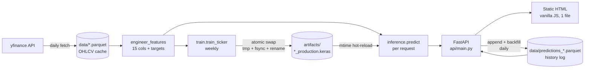

# Next-Day Stock Prediction — Productionized

> A self-retraining web service that predicts **direction** and **expected return** for the next trading session of **MSFT** and **SPX**. Trained on 35 years of daily bars per ticker, retrains itself weekly on fresh data, and reports its accuracy honestly — including when the model does not beat a naive baseline.

<!-- Replace this placeholder once the live UI is screenshotted: drop the PNG at docs/screenshot.png -->
<!--  -->

## What this is, in 60 seconds

This started as a research notebook comparing LSTM and Transformer architectures on Microsoft stock (preserved in [`research/`](research/)). I took it the rest of the way: **a notebook with stale data and a denormalization bug → a live FastAPI service with a static dashboard, daily prediction logging, weekly atomic retrain, and an honest holdout metrics table that openly admits where the model fails.**

The CV story is **the productionization**, not the predictive accuracy. The notebook's "53% test accuracy" wasn't real signal — it disappears the moment you discipline the holdout. The honest version of the project keeps that finding visible, and ships the system that *would* have detected the regression if there had been one.

## Architecture



Three deterministic CLIs sit underneath, each with its own SOP:

| Cadence | Script | Workflow |
|---|---|---|
| Daily 22:00 | [`tools/fetch_market_data.py`](tools/fetch_market_data.py) | [refresh_data.md](workflows/refresh_data.md) |
| Daily 22:15 | [`tools/log_prediction.py`](tools/log_prediction.py) | [weekly_retrain.md](workflows/weekly_retrain.md) |
| Sun 03:00 | [`tools/retrain_all.py`](tools/retrain_all.py) | [weekly_retrain.md](workflows/weekly_retrain.md) |

The CLIs are wired into **Windows Task Scheduler** locally; the SOP also describes the systemd-timer equivalents for a Linux VM (deployment was scoped out of v1 — see [Future work](#future-work)).

## Honest holdout metrics

A bake-off in Phase 4 trained both a Transformer (encoder-only, dual-head, ~87k params) and an XGBoost baseline per ticker, on the same 252-trading-day holdout, with two STL outlier-removal settings A/B'd for the transformer. **Direction accuracy** is the headline; **naive baselines** are reported alongside; the **honesty gate** declares whether the winner beat naive_always_up by ≥3 percentage points.

### MSFT (Microsoft) — 252-day holdout

| Model | STL | dir_acc | dir_auc | return_mae | naive_always_up | honesty gate |
|---|---|---|---|---|---|---|
| **Transformer (production)** | off | **0.5238** | 0.469 | 0.0109 | 0.5238 | **❌ FAIL** (delta 0.00 pp) |
| Transformer | on | 0.5119 | 0.431 | 0.0181 | 0.5238 | — |
| XGBoost | on | 0.4603 | 0.453 | 0.0116 | 0.5238 | — |

### SPX (S&P 500) — 252-day holdout

| Model | STL | dir_acc | dir_auc | return_mae | naive_always_up | honesty gate |
|---|---|---|---|---|---|---|
| **Transformer (production)** | on | **0.5714** | 0.500 | **0.0059** | 0.5714 | **❌ FAIL** (delta 0.00 pp) |
| Transformer | off | 0.5714 | 0.510 | 0.0133 | 0.5714 | — |
| XGBoost | on | 0.5397 | 0.485 | 0.0065 | 0.5714 | — |

### What this says

- **Neither winner beats the always-predict-up baseline on direction.** This is genuine; it's what the data, this feature set, and a single-day horizon support. We do not bury it.
- **The return-regression head is doing real work**: every model beats the random-walk return RMSE baseline. The directional head is the failure mode.
- **Run-to-run variance from training stochasticity is ~5 pp AUC** — bigger than any cross-model difference. Any "edge" smaller than that noise floor is indistinguishable from a lucky seed (see [LEARNING_NOTES.md](LEARNING_NOTES.md) Chapter 5 for the full investigation).
- The dashboard surfaces this verdict as a red **FAIL** banner under the holdout metrics on every ticker tab. The point of the gate is to make hiding the result harder than disclosing it.

> **What this means for the system:** the daily prediction is generated honestly and logged, the system retrains itself, and the UI is straight with the user about how much to trust the number. That's the production story.

## Run it locally

### Prerequisites
- Windows 10/11 (Linux/macOS should also work with path edits)
- Python 3.11 or newer (3.13 tested)
- ~1 GB free disk for TF + the venv

### One-time setup

```powershell
# Put the venv OUTSIDE the project directory if the project lives in iCloud Drive.
# iCloud syncs every .pyc and can evict bytes Python needs at runtime.
New-Item -ItemType Directory -Force -Path C:\venvs\stock-predictor | Out-Null
python -m venv C:\venvs\stock-predictor\.venv

& "C:\venvs\stock-predictor\.venv\Scripts\python.exe" -m pip install -r requirements.txt

# Fetch ~35 years of daily bars per ticker (~9k rows each, ~390 KB each).
& "C:\venvs\stock-predictor\.venv\Scripts\python.exe" -m tools.fetch_market_data

# Train both tickers, run the bake-off, promote winners to production.
# Takes ~10 min per ticker on CPU (this writes ~14 artifacts in artifacts/).
& "C:\venvs\stock-predictor\.venv\Scripts\python.exe" -m tools.train_model --ticker MSFT --all
& "C:\venvs\stock-predictor\.venv\Scripts\python.exe" -m tools.train_model --ticker SPX  --all
```

### Run the dashboard

```powershell
& "C:\venvs\stock-predictor\.venv\Scripts\python.exe" -m uvicorn api.main:app --host 127.0.0.1 --port 8771
```

Open <http://127.0.0.1:8771/> — you'll see two ticker tabs, a prediction card with direction/return/implied-close, the honest metrics block, and an empty history table that will populate as the daily logger runs.

### Self-running (optional)

Three Windows Task Scheduler entries reproduce the daily/weekly cadence the system was designed for. The SOP at [`workflows/weekly_retrain.md`](workflows/weekly_retrain.md) documents the invocations:

```powershell
# Daily 22:00 — refresh data
& "C:\venvs\stock-predictor\.venv\Scripts\python.exe" -m tools.fetch_market_data

# Daily 22:15 — log prediction + backfill yesterday's outcome
& "C:\venvs\stock-predictor\.venv\Scripts\python.exe" -m tools.log_prediction

# Sundays 03:00 — refit weights + atomic swap
& "C:\venvs\stock-predictor\.venv\Scripts\python.exe" -m tools.retrain_all
```

The API uses an mtime-based hot reload on each `/predict` call — a Sunday retrain becomes visible without restarting the server.

## Project structure

The repo follows the **WAT framework** ([Workflows / Agents / Tools](CLAUDE.md)) — markdown SOPs separate from deterministic Python scripts, with the AI orchestrator (Claude) in between.

```
src/                  importable Python library
├── config.py         TICKERS dict + per-ticker hparams (the contract)
├── data.py           fetch + features + normalizer + split + sequences
├── models/
│   ├── transformer.py  dual-head encoder, ~87k params, Keras 3
│   └── xgb.py          XGBClassifier + XGBRegressor (baseline)
├── train.py          train_ticker + run_bakeoff + honesty gate + metadata
└── inference.py      ModelHandle + maybe_reload (mtime hot-reload) + predict

tools/                CLI entry points (run via -m tools.X)
├── fetch_market_data.py
├── train_model.py
├── log_prediction.py
├── retrain_all.py
└── predict.py

api/                  FastAPI service
├── main.py           lifespan loader + /predict + /metadata + /history + /static
├── schemas.py        Pydantic response models (informational)
└── static/index.html single-file, no-framework dashboard

workflows/            markdown SOPs for each operation
├── refresh_data.md
├── weekly_retrain.md
└── serve_predictions.md

research/             archived original notebook (LSTM vs Transformer comparison)
data/                 OHLCV parquet caches + predictions log (gitignored)
artifacts/            trained models + metadata + bake-off results (gitignored)
```

## Future work

What's intentionally **not** in v1, in rough order of cost-to-impact:

1. **Public deployment** (was Phase 8 in the original plan) — systemd timers + nginx + Let's Encrypt on a Linux VM. The system already self-runs on Windows via Task Scheduler; lifting it to a public URL is a runbook task, not a code task. The Phase 8 spec lives in [PLAN.md](PLAN.md) if I come back to it.
2. **Stronger features** — sentiment (news, X/Twitter), options-implied volatility, sector rotation, intraday volume profile. The current 15-feature set is what's extractable from daily OHLCV alone; the honesty gate verdict says that's not enough on a 1-day horizon.
3. **Longer prediction horizons** — 5-day or 20-day return. Single-day direction is the hardest possible target; broader horizons average over more signal and less noise.
4. **Drift detection** — distribution shift alerts on the input features and on holdout accuracy. With the prediction log Phase 7 produces, the building blocks are there; the missing piece is the alerting glue.
5. **Bayesian uncertainty intervals** — replace the point `direction_prob` with a calibrated credible interval. The honest "I'm 52% confident up" beats a falsely-precise number when the underlying signal is this weak.
6. **Ensembling** — average the Transformer and XGBoost predictions. Cheap to ship, often the easiest gain on small-sample tabular tasks.
7. **Containerization** — Docker for the production deploy. Skipped in v1 because plain venv + systemd is simpler to debug on a single-server, single-service portfolio piece; promoted if the deployment grows multiple services.
8. **CI** — GitHub Actions running pytest + the bake-off as a smoke test. Tests themselves were also intentionally skipped in v1 (the smoke-test discipline lived in throwaway `.tmp/` scripts during each phase).

## Reading the source

If you have an hour:

1. **[PLAN.md](PLAN.md)** — the 700-line contract for the migration. Read Phase 0 (decisions made before any code) and Phase 4 (the bake-off + honesty gate). This document was written *before* the code and barely changed during execution.
2. **[LEARNING_NOTES.md](LEARNING_NOTES.md)** — a chronological story of what actually happened, with **What this means** boxes for every concept I had to learn along the way. ~30 KB of narrative; explicitly built for "data scientist who's never shipped a service before."
3. **[docs/journey.md](docs/journey.md)** — a ~1000 word blog-style writeup of the whole arc. The version a recruiter reads in 90 seconds.

## Research provenance

The original notebook is preserved verbatim at [`research/Deep Learning for Stock Price Prediction with LSTM and Transformers.ipynb`](research/) — including the denormalization bug at notebook lines 1634–1636 and the full-dataset normalizer fit (the data-leakage bug the production system fixes). It's archived as the scientific artifact this project started from, not the production code.

## License & disclaimer

This is a portfolio / educational project. **Predictions are informational only and are not financial advice.** Past performance — especially holdout performance — does not predict future returns. The honesty gate explicitly says the directional signal is not extractable from this feature set on a 1-day horizon; treat the displayed predictions accordingly.

---

<sub>Built by Nino (2026). Productionized from a research notebook in 7 phases over ~2 weeks, with Claude Code as orchestrator under the WAT framework.</sub>
